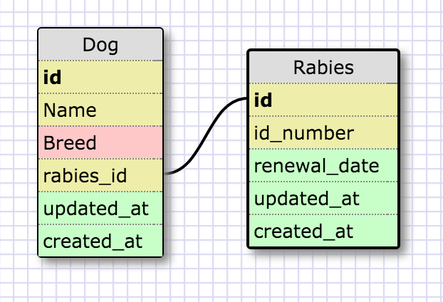

# 8.5 More Schemas

# Release 2 : One-to-One

# Release 4 : Grocery List Database

# Reflection

## What is a one-to-one database?

The coolest thing about databases is how you can connect different pieces of data. This comes in to play with one-to-one relationships, when two things have a single connection to one another. Basically, for items that are pairs.

## When would you use a one-to-one database? (Think generally, not in terms of the example you created).

You use a one-to-one database when items are pairs, when they go together. For example, one-to-one databases may be frequently utilized when people or things are tagged with some sort of identification number that requires additional information. For example, if you had a table of all the people in the United States, you may also have a table of drivers licenses in the country. In this example, people and drivers licenses are paired.

## What is a many-to-many database?

Many-to-many relationships connect many different types of a table to many different types of another table.

## When would you use a many-to-many database? (Think generally, not in terms of the example you created).

An example of a many-to-many relationship is teachers and students. While a teacher has many students, a student may have many teachers. In order to join these two concepts, you might utilize a join table.

## What is confusing about database schemas? What makes sense?

Database schemas seem to make sense, however I believe they will be much more difficult to design and implement in real life. I believe it is much easier to understand databases after they have been made, than to correctly identify relationships before and build them with all the right connections and variables.